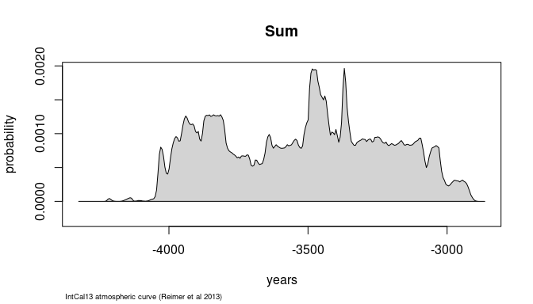

Basic Usage
================
Martin Hinz
2017-06-26

The package `oxcAAR` is designed to represent an interface between R and [Oxcal](https://c14.arch.ox.ac.uk). It offers the posibility to parse Oxcal scripts from data within R, execute these scripts and reread the results from the Oxcal output files. There are other packages out that also can calibrate <sup>14</sup>C data, like eg. `Bchron`, which will be sufficient and probably also faster than using `oxcAAR`. But this package is intended to use especially the algorithms of Oxcal, which is a quasi-standard for archaeological research these days.

Calibration (R\_Date)
---------------------

Lets assume, we want to calibrate a date 5000 BP +- 25 years. `oxcAAR` has the function `oxcalCalibrate` for doing so. But at first we have to load the package and tell it where to find the local path to the [Oxcal distribution](https://c14.arch.ox.ac.uk/OxCalDistribution.zip). Than you can calibrate the date using bp, std and name.

``` r
library(oxcAAR)
setOxcalExecutablePath("~/OxCal/bin/OxCalLinux")
```

    ## [1] "Oxcal path set!"

``` r
my_date <- oxcalCalibrate(5000,25,"KIA-12345")
my_date
```

    ## 
    ##  KIA-12345
    ## BP = 5000, std = 25
    ## 
    ##   one sigma: 3796 BC - 3712 BC
    ##   two sigma: 3931 BC - 3704 BC
    ## three sigma: 3944 BC - 3692 BC
    ## 
    ## Calibrated after:
    ##    IntCal13 atmospheric curve (Reimer et al 2013)

``` r
plot(my_date)
```


You can also calibrate multiple dates at once:

``` r
my_uncal_dates <- data.frame(bp=c(5000,4500,4000),
                             std=c(45,35,25),
                             names=c("Date 1", "Date 2", "Date 3")
                             )
my_cal_dates <- oxcalCalibrate(my_uncal_dates$bp, my_uncal_dates$std, my_uncal_dates$names)
my_cal_dates
```

    ## List of 3 calibrated dates:
    ## 
    ##  Date 1
    ## BP = 5000, std = 45
    ## 
    ##   one sigma: 3910 BC - 3706 BC
    ##   two sigma: 3942 BC - 3668 BC
    ## three sigma: 3954 BC - 3652 BC
    ## 
    ## Calibrated after:
    ##    IntCal13 atmospheric curve (Reimer et al 2013) 
    ## 
    ##  Date 2
    ## BP = 4500, std = 35
    ## 
    ##   one sigma: 3334 BC - 3104 BC
    ##   two sigma: 3353 BC - 3089 BC
    ## three sigma: 3363 BC - 3020 BC
    ## 
    ## Calibrated after:
    ##    IntCal13 atmospheric curve (Reimer et al 2013) 
    ## 
    ##  Date 3
    ## BP = 4000, std = 25
    ## 
    ##   one sigma: 2564 BC - 2478 BC
    ##   two sigma: 2572 BC - 2470 BC
    ## three sigma: 2618 BC - 2460 BC
    ## 
    ## Calibrated after:
    ##    IntCal13 atmospheric curve (Reimer et al 2013)

``` r
plot(my_cal_dates)
```


The resulting object from the calibration is a list of class `oxcAARCalibratedDatesList`, containing elements of class `oxcAARCalibratedDate`. Each of these dates is again a list of the essential informations of the calibrated date including the raw probabilities, that can be extracted for additional analysis:

``` r
str(my_cal_dates, max.level = 1)
```

    ## List of 3
    ##  $ Date 1:List of 6
    ##   ..- attr(*, "class")= chr "oxcAARCalibratedDate"
    ##  $ Date 2:List of 6
    ##   ..- attr(*, "class")= chr "oxcAARCalibratedDate"
    ##  $ Date 3:List of 6
    ##   ..- attr(*, "class")= chr "oxcAARCalibratedDate"
    ##  - attr(*, "class")= chr [1:2] "list" "oxcAARCalibratedDatesList"

``` r
my_cal_dates[[1]] # equivalent to my_cal_dates[["Date 1"]] or my_cal_dates$`Date 1`
```

    ## 
    ##  Date 1
    ## BP = 5000, std = 45
    ## 
    ##   one sigma: 3910 BC - 3706 BC
    ##   two sigma: 3942 BC - 3668 BC
    ## three sigma: 3954 BC - 3652 BC
    ## 
    ## Calibrated after:
    ##    IntCal13 atmospheric curve (Reimer et al 2013)

``` r
str(my_cal_dates$`Date 1`)
```

    ## List of 6
    ##  $ name             : chr "Date 1"
    ##  $ bp               : int 5000
    ##  $ std              : int 45
    ##  $ cal_curve        : chr " IntCal13 atmospheric curve (Reimer et al 2013)"
    ##  $ sigma_ranges     :List of 3
    ##   ..$ one_sigma  :'data.frame':  2 obs. of  3 variables:
    ##   .. ..$ start      : num [1:2] -3910 -3802
    ##   .. ..$ end        : num [1:2] -3876 -3706
    ##   .. ..$ probability: num [1:2] 14.9 53.3
    ##   ..$ two_sigma  :'data.frame':  2 obs. of  3 variables:
    ##   .. ..$ start      : num [1:2] -3942 -3676
    ##   .. ..$ end        : num [1:2] -3692 -3668
    ##   .. ..$ probability: num [1:2] 94.3 1.1
    ##   ..$ three_sigma:'data.frame':  1 obs. of  3 variables:
    ##   .. ..$ start      : num -3954
    ##   .. ..$ end        : num -3652
    ##   .. ..$ probability: num 99.7
    ##  $ raw_probabilities:'data.frame':   108 obs. of  2 variables:
    ##   ..$ dates        : num [1:108] -4054 -4050 -4044 -4040 -4034 ...
    ##   ..$ probabilities: num [1:108] 0.00 0.00 0.00 1.94e-08 1.49e-07 ...
    ##  - attr(*, "class")= chr "oxcAARCalibratedDate"

``` r
plot(
  my_cal_dates$`Date 1`$raw_probabilities$dates,
  my_cal_dates$`Date 1`$raw_probabilities$probabilities,
  type = "l",
  xlab = "years",
  ylab = "probs"
  )
```


Simulation (R\_Simulate)
------------------------

You can also use `oxcAAR` to simulate <sup>14</sup>C dates in the same way as OxCal R\_Simulate function works. You enter a calibrated year (1000 for 1000 AD, -1000 for 1000 BC), and OxCal will simulate a BP value using a bit of randomisation. This results in the fact that each run will have a slightly different BP value.

``` r
my_cal_date <- data.frame(bp=c(-3400),
                             std=c(25),
                             names=c("SimDate_1")
                             )
my_simulated_dates <- oxcalSimulate(my_cal_date$bp,
                                    my_cal_date$std,
                                    my_cal_date$names
                                    )
# equivalent to
my_simulated_dates <- oxcalSimulate(-3400, 25, "SimDate_1")
my_simulated_dates
```

    ## 
    ##  SimDate_1
    ## BP = 4708, std = 25
    ## 
    ##   one sigma: 3620 BC - 3378 BC
    ##   two sigma: 3628 BC - 3374 BC
    ## three sigma: 3634 BC - 3370 BC
    ## 
    ## Calibrated after:
    ##    IntCal13 atmospheric curve (Reimer et al 2013)

``` r
plot(my_simulated_dates)
```


Simulate Sum Calibration
------------------------

This package was originally intended to support a series of articles dealing with the investigation of sum calibration. That is why a function is implemented to simulate sum calibration. You can use it to simulate a series of <sup>14</sup>C dates and explore the sum calibrated results. You can specify the beginning and end of the time span that should be used for the simulation (in calendar years), the number of <sup>14</sup>C dates that should be simulated, their standard deviation either as vector of length n or as one number for all dates, and the type of distribution that should be used (either equally spaced in time, or random uniform). The result is again of class `oxcAARCalibratedDate`, so you can access the raw probabilities for further analysis.

``` r
my_sum_sim<-oxcalSumSim(
  timeframe_begin = -4000,
  timeframe_end = -3000,
  n = 50,
  stds = 35,
  date_distribution = "uniform"
  )
str(my_sum_sim)
```

    ## List of 6
    ##  $ name             : chr " Sum "
    ##  $ bp               : int(0) 
    ##  $ std              : int(0) 
    ##  $ cal_curve        : chr " IntCal13 atmospheric curve (Reimer et al 2013)"
    ##  $ sigma_ranges     :List of 3
    ##   ..$ one_sigma  :'data.frame':  0 obs. of  3 variables:
    ##   .. ..$ start      : num(0) 
    ##   .. ..$ end        : num(0) 
    ##   .. ..$ probability: num(0) 
    ##   ..$ two_sigma  :'data.frame':  0 obs. of  3 variables:
    ##   .. ..$ start      : num(0) 
    ##   .. ..$ end        : num(0) 
    ##   .. ..$ probability: num(0) 
    ##   ..$ three_sigma:'data.frame':  0 obs. of  3 variables:
    ##   .. ..$ start      : num(0) 
    ##   .. ..$ end        : num(0) 
    ##   .. ..$ probability: num(0) 
    ##  $ raw_probabilities:'data.frame':   293 obs. of  2 variables:
    ##   ..$ dates        : num [1:293] -4324 -4320 -4314 -4310 -4304 ...
    ##   ..$ probabilities: num [1:293] 0.00 0.00 1.96e-09 1.96e-09 3.93e-09 ...
    ##  - attr(*, "class")= chr "oxcAARCalibratedDate"

``` r
plot(my_sum_sim)
```



Execute custom OxCal code
-------------------------

You can also use the package to execute your own OxCal code from within R, and import the results back into the workspace. You can use `R_Date`, `R_Simulate` and `oxcal_Sum` to produce that OxCal code:

``` r
R_Simulate(-4000, 25, "MySimDate")
```

    ## [1] "R_Simulate(\"MySimDate\",\n          -4000, 25);"

``` r
my_dates <- R_Date(c("Lab-12345","Lab-54321"), c(5000,4500), 25)
cat(my_dates)
```

    ## R_Date("Lab-12345", 5000, 25);
    ## R_Date("Lab-54321", 4500, 25);

``` r
my_sum <- oxcal_Sum(my_dates)
cat(my_sum)
```

    ## Sum(" Sum "){
    ##  R_Date("Lab-12345", 5000, 25);
    ## R_Date("Lab-54321", 4500, 25); 
    ## };

or use your own script as string variable.

``` r
knitr::opts_chunk$set(cache=TRUE)
my_oxcal_code <- ' Plot()
 {
  Sequence("Sequence1")
  {
   Boundary("Beginn");
   Phase("Phase1")
   {
    R_Date("Lab-1",5000,25);
    R_Date("Lab-2",4900,37);
   };
   Boundary("Between");
   Phase("Phase2")
   {
    R_Date("Lab-3",4800,43);
   };
   Boundary("End");
  };
 };'
my_result_file <- executeOxcalScript(my_oxcal_code)
my_result_text <- readOxcalOutput(my_result_file)
my_result_data <- parseFullOxcalOutput(my_result_text)
str(my_result_data)
```

    ## List of 12
    ##  $ ocd[0]  :List of 4
    ##   ..$ likelihood:List of 5
    ##   .. ..$ comment   :List of 1
    ##   .. .. ..$ : list()
    ##   .. ..$ comment[0]: chr "OxCal v4.3.2 Bronk Ramsey (2017); r:5"
    ##   .. ..$ comment[1]: chr " IntCal13 atmospheric curve (Reimer et al 2013)"
    ##   .. ..$ comment[2]: chr "( Phase Phase1"
    ...
