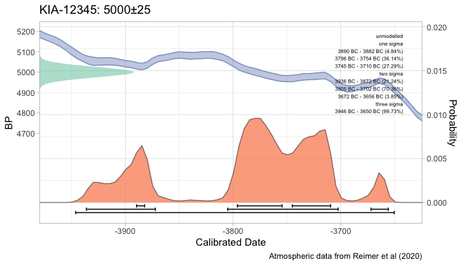
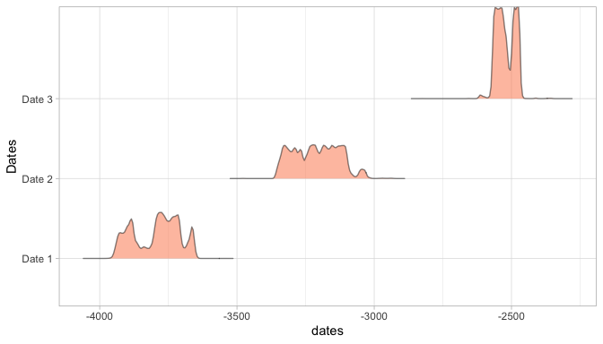
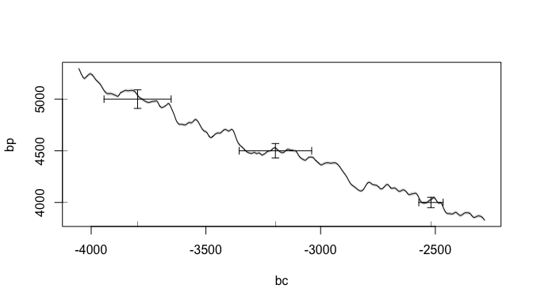
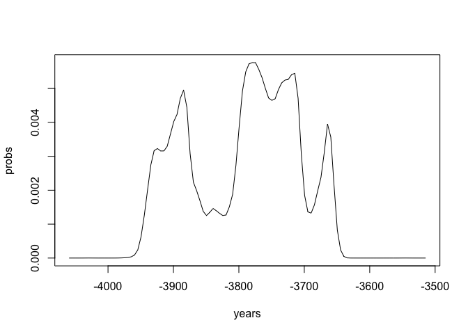
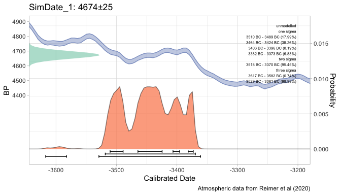
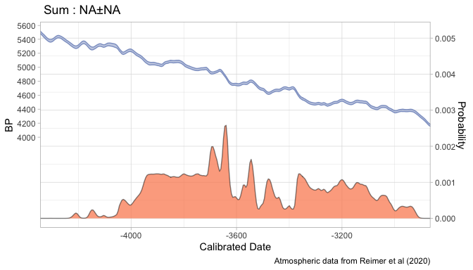

Basic Usage
================
Martin Hinz(translation:Chanhyeok-Ju)

[ENG](vignettes/basic-usage.Rmd) / [KOR](vignettes/basic-usage_ko.Rmd)

`oxcAAR`은 R과 [Oxcal](https://c14.arch.ox.ac.uk) 사이의 인터페이스를
나타내도록 설계되었습니다. 이를 통해 R 내에서 OxCal 스크립트를 실행하고,
분석 결과를 불러올 수 있습니다. 물론 Bchron과 같은 다른 패키지들을 통해
더 빠르게 <sup>14</sup>C 데이터 보정할 수 있습니다. 하지만 OxCal은
오늘날 고고학 연구의 준표준이며 `oxcAAR`은 이러한 Oxcal을 활용할 수 있는
패키지입니다.

## 연대보정 (R_Date)

5000BP +- 25년인 연대측정치를 보정한다고 가정하겠습니다. 우리는
`oxcAAR`의 `oxcalCalibrate` 함수를 통해 연대보정을 실행할 수 있습니다.
그러나 먼저 패키지를 불러오고 [Oxcal
distribution](https://c14.arch.ox.ac.uk/OxCalDistribution.zip)의 로컬
주소를 알고있어야 합니다. 이후 BP, Std 및 분석명을 사용하여 연대보정을
할 수 있습니다.

``` r
library(ggplot2)
```

    ## Warning: package 'ggplot2' was built under R version 4.1.2

``` r
library(oxcAAR)
quickSetupOxcal()
```

    ## Oxcal doesn't seem to be installed. Downloading it now:

    ## Oxcal stored successful at /private/var/folders/19/n89t4zs54bd39pyyzk1s03l80000gn/T/Rtmpg4hx9n!

    ## Oxcal path set!

    ## NULL

``` r
#setOxcalExecutablePath("~/OxCal/bin/OxCalLinux")
my_date <- oxcalCalibrate(5000,25,"KIA-12345")
my_date
```

    ## 
    ## =============================
    ##  R_Date: KIA-12345
    ## =============================
    ## 
    ## 
    ## BP = 5000, std = 25
    ## 
    ## 
    ## unmodelled:                    posterior:
    ## 
    ## one sigma                      
    ## 3890 BC - 3882 BC (4.84%)      
    ## 3796 BC - 3754 BC (36.14%)     
    ## 3745 BC - 3710 BC (27.29%)     
    ## 
    ## two sigma                      
    ## 3936 BC - 3872 BC (21.24%)     
    ## 3805 BC - 3702 BC (70.36%)     
    ## 3672 BC - 3656 BC (3.85%)      
    ## 
    ## three sigma                    
    ## 3946 BC - 3650 BC (99.73%)     
    ## 
    ## Calibrated with:
    ##   Atmospheric data from Reimer et al (2020)

``` r
plot(my_date)
```

    ## Warning: It is deprecated to specify `guide = FALSE` to remove a guide. Please
    ## use `guide = "none"` instead.

<!-- -->

여러 연대측정치를 동시에 보정하는 것이 가능합니다.:

``` r
my_uncal_dates <- data.frame(bp=c(5000,4500,4000),
                             std=c(45,35,25),
                             names=c("Date 1", "Date 2", "Date 3")
                             )
my_cal_dates <- oxcalCalibrate(my_uncal_dates$bp, my_uncal_dates$std, my_uncal_dates$names)
my_cal_dates
```

    ## List of 3 calibrated dates:
    ## 
    ## =============================
    ##  R_Date: Date 1
    ## =============================
    ## 
    ## 
    ## BP = 5000, std = 45
    ## 
    ## 
    ## unmodelled:                    posterior:
    ## 
    ## one sigma                      
    ## 3926 BC - 3922 BC (1.25%)      
    ## 3913 BC - 3875 BC (15.11%)     
    ## 3802 BC - 3705 BC (48.04%)     
    ## 3669 BC - 3658 BC (3.87%)      
    ## 
    ## two sigma                      
    ## 3944 BC - 3852 BC (28.55%)     
    ## 3846 BC - 3830 BC (2.15%)      
    ## 3818 BC - 3652 BC (64.75%)     
    ## 
    ## three sigma                    
    ## 3954 BC - 3644 BC (99.73%)     
    ## 
    ## Calibrated with:
    ##   Atmospheric data from Reimer et al (2020) 
    ## 
    ## =============================
    ##  R_Date: Date 2
    ## =============================
    ## 
    ## 
    ## BP = 4500, std = 35
    ## 
    ## 
    ## unmodelled:                    posterior:
    ## 
    ## one sigma                      
    ## 3336 BC - 3308 BC (10.7%)      
    ## 3298 BC - 3282 BC (5.55%)      
    ## 3272 BC - 3266 BC (2.14%)      
    ## 3240 BC - 3206 BC (13.46%)     
    ## 3194 BC - 3102 BC (36.41%)     
    ## 
    ## two sigma                      
    ## 3355 BC - 3090 BC (94.3%)      
    ## 3049 BC - 3039 BC (1.15%)      
    ## 
    ## three sigma                    
    ## 3368 BC - 3012 BC (99.73%)     
    ## 
    ## Calibrated with:
    ##   Atmospheric data from Reimer et al (2020) 
    ## 
    ## =============================
    ##  R_Date: Date 3
    ## =============================
    ## 
    ## 
    ## BP = 4000, std = 25
    ## 
    ## 
    ## unmodelled:                    posterior:
    ## 
    ## one sigma                      
    ## 2565 BC - 2528 BC (42.42%)     
    ## 2494 BC - 2472 BC (25.85%)     
    ## 
    ## two sigma                      
    ## 2572 BC - 2466 BC (95.45%)     
    ## 
    ## three sigma                    
    ## 2624 BC - 2454 BC (99.73%)     
    ## 
    ## Calibrated with:
    ##   Atmospheric data from Reimer et al (2020)

``` r
plot(my_cal_dates)
```

    ## Warning: It is deprecated to specify `guide = FALSE` to remove a guide. Please
    ## use `guide = "none"` instead.

<!-- -->

보정곡선에 그래프를 그리는 것이 가능합니다.:

``` r
calcurve_plot(my_cal_dates)
```

<!-- -->

보정결과 객체는 `oxcAARCalibratedDatesList` 클래스의 `List`이고,
`oxcAARCalibratedDate` 클래스의 요소를 포함하고 있습니다. 이러한 각각의
연대들은 본래의 확률을 포함하기 때문에 필수적이며, 추가 분석을 위해
추출하여 활용할 수 있습니다.

``` r
str(my_cal_dates, max.level = 1)
```

    ## List of 3
    ##  $ Date 1:List of 9
    ##   ..- attr(*, "class")= chr "oxcAARCalibratedDate"
    ##  $ Date 2:List of 9
    ##   ..- attr(*, "class")= chr "oxcAARCalibratedDate"
    ##  $ Date 3:List of 9
    ##   ..- attr(*, "class")= chr "oxcAARCalibratedDate"
    ##  - attr(*, "class")= chr [1:2] "list" "oxcAARCalibratedDatesList"

``` r
my_cal_dates[[1]] # equivalent to my_cal_dates[["Date 1"]] or my_cal_dates$`Date 1`
```

    ## 
    ## =============================
    ##  R_Date: Date 1
    ## =============================
    ## 
    ## 
    ## BP = 5000, std = 45
    ## 
    ## 
    ## unmodelled:                    posterior:
    ## 
    ## one sigma                      
    ## 3926 BC - 3922 BC (1.25%)      
    ## 3913 BC - 3875 BC (15.11%)     
    ## 3802 BC - 3705 BC (48.04%)     
    ## 3669 BC - 3658 BC (3.87%)      
    ## 
    ## two sigma                      
    ## 3944 BC - 3852 BC (28.55%)     
    ## 3846 BC - 3830 BC (2.15%)      
    ## 3818 BC - 3652 BC (64.75%)     
    ## 
    ## three sigma                    
    ## 3954 BC - 3644 BC (99.73%)     
    ## 
    ## Calibrated with:
    ##   Atmospheric data from Reimer et al (2020)

``` r
str(my_cal_dates$`Date 1`)
```

    ## List of 9
    ##  $ name                   : chr "Date 1"
    ##  $ type                   : chr "R_Date"
    ##  $ bp                     : int 5000
    ##  $ std                    : int 45
    ##  $ cal_curve              :List of 5
    ##   ..$ name      : chr "Atmospheric data from Reimer et al (2020)"
    ##   ..$ resolution: num 5
    ##   ..$ bp        : num [1:11000] 50100 50095 50090 50086 50081 ...
    ##   ..$ bc        : num [1:11000] -53050 -53044 -53040 -53034 -53030 ...
    ##   ..$ sigma     : num [1:11000] 1024 1022 1021 1020 1018 ...
    ##  $ sigma_ranges           :List of 3
    ##   ..$ one_sigma  :'data.frame':  4 obs. of  3 variables:
    ##   .. ..$ start      : num [1:4] -3926 -3913 -3802 -3669
    ##   .. ..$ end        : num [1:4] -3922 -3875 -3705 -3658
    ##   .. ..$ probability: num [1:4] 1.25 15.11 48.04 3.87
    ##   ..$ two_sigma  :'data.frame':  3 obs. of  3 variables:
    ##   .. ..$ start      : num [1:3] -3944 -3846 -3818
    ##   .. ..$ end        : num [1:3] -3852 -3830 -3652
    ##   .. ..$ probability: num [1:3] 28.55 2.15 64.75
    ##   ..$ three_sigma:'data.frame':  1 obs. of  3 variables:
    ##   .. ..$ start      : num -3954
    ##   .. ..$ end        : num -3644
    ##   .. ..$ probability: num 99.7
    ##  $ raw_probabilities      :'data.frame': 110 obs. of  2 variables:
    ##   ..$ dates        : num [1:110] -4060 -4054 -4050 -4044 -4040 ...
    ##   ..$ probabilities: num [1:110] 0.00 0.00 0.00 1.15e-08 8.65e-08 ...
    ##  $ posterior_sigma_ranges :List of 3
    ##   ..$ one_sigma  : logi NA
    ##   ..$ two_sigma  : logi NA
    ##   ..$ three_sigma: logi NA
    ##  $ posterior_probabilities: logi NA
    ##  - attr(*, "class")= chr "oxcAARCalibratedDate"

``` r
plot(
  my_cal_dates$`Date 1`$raw_probabilities$dates,
  my_cal_dates$`Date 1`$raw_probabilities$probabilities,
  type = "l",
  xlab = "years",
  ylab = "probs"
  )
```

<!-- -->

## 시뮬레이션 (R_Simulate)

`oxcAAR`을 사용하여 OxCal의 R_Simulate 함수와 같은 방법으로
<sup>14</sup>C 연대 시뮬레이션을 실행할 수 있습니다. 보정된 연대(Ex.
A.D. 1000 : 1000 / B.C. 1000 : -1000)를 입력하면 OxCal이 무작위로 BP값을
시뮬레이션합니다. 결과적으로 각각의 시뮬레이션은 약간 다른 값을 갖게
됩니다.

``` r
my_cal_date <- data.frame(bp=c(-3400),
                             std=c(25),
                             names=c("SimDate_1")
                             )
my_simulated_dates <- oxcalSimulate(my_cal_date$bp,
                                    my_cal_date$std,
                                    my_cal_date$names
                                    )
# equivalent to
my_simulated_dates <- oxcalSimulate(-3400, 25, "SimDate_1")
my_simulated_dates
```

    ## 
    ## =============================
    ##  R_Simulate: SimDate_1
    ## =============================
    ## 
    ## 
    ## BP = 4674, std = 25
    ## 
    ## 
    ## unmodelled:                    posterior:
    ## 
    ## one sigma                      
    ## 3510 BC - 3489 BC (17.99%)     
    ## 3464 BC - 3424 BC (35.26%)     
    ## 3406 BC - 3396 BC (8.19%)      
    ## 3382 BC - 3373 BC (6.83%)      
    ## 
    ## two sigma                      
    ## 3518 BC - 3370 BC (95.45%)     
    ## 
    ## three sigma                    
    ## 3617 BC - 3582 BC (0.74%)      
    ## 3529 BC - 3361 BC (98.99%)     
    ## 
    ## Calibrated with:
    ##   Atmospheric data from Reimer et al (2020)

``` r
plot(my_simulated_dates)
```

    ## Warning: It is deprecated to specify `guide = FALSE` to remove a guide. Please
    ## use `guide = "none"` instead.

<!-- -->

## 합산 보정연대 시뮬레이션

본래 이 패키지는 합산 보정연대를 다루는 일련의 논고를 위해
만들어졌습니다. 합산 보정연대를 시뮬레이션하는 기능이 구현된 이유이기도
합니다. 이 함수를 활용하여 <sup>14</sup>C 연대를 시뮬레이션하고 보정된
결과를 살펴볼 수 있습니다. 시뮬레이션에 사용될 시간 범위의 시작연도와
마지막연도, 시뮬레이션해야하는 <sup>14</sup>C 연대의 수, 표준편차,
길이가 n인 벡터 혹은 모든 연대에 대한 하나의 값, 사용할 분포 유형(동일
시간 간격 혹은 무작위한 균일)을 지정하여 시뮬레이션할 수 있습니다.
시뮬레이션 결과는 `oxcAARCalibratedDate` 클래스로 환원되므로 본래의
확률과 액세스하여 추가적인 분석을 시행할 수 있습니다.:

``` r
my_sum_sim<-oxcalSumSim(
  timeframe_begin = -4000,
  timeframe_end = -3000,
  n = 50,
  stds = 35,
  date_distribution = "uniform"
  )
str(my_sum_sim)
```

    ## List of 9
    ##  $ name                   : chr " Sum "
    ##  $ type                   : chr "Sum"
    ##  $ bp                     : logi NA
    ##  $ std                    : logi NA
    ##  $ cal_curve              :List of 5
    ##   ..$ name      : chr "Atmospheric data from Reimer et al (2020)"
    ##   ..$ resolution: num 5
    ##   ..$ bp        : num [1:11000] 50100 50095 50090 50086 50081 ...
    ##   ..$ bc        : num [1:11000] -53050 -53044 -53040 -53034 -53030 ...
    ##   ..$ sigma     : num [1:11000] 1024 1022 1021 1020 1018 ...
    ##  $ sigma_ranges           :List of 3
    ##   ..$ one_sigma  : logi NA
    ##   ..$ two_sigma  : logi NA
    ##   ..$ three_sigma: logi NA
    ##  $ raw_probabilities      :'data.frame': 297 obs. of  2 variables:
    ##   ..$ dates        : num [1:297] -4344 -4340 -4334 -4330 -4324 ...
    ##   ..$ probabilities: num [1:297] 0.00 0.00 0.00 2.58e-09 1.03e-08 ...
    ##  $ posterior_sigma_ranges :List of 3
    ##   ..$ one_sigma  : logi NA
    ##   ..$ two_sigma  : logi NA
    ##   ..$ three_sigma: logi NA
    ##  $ posterior_probabilities: logi NA
    ##  - attr(*, "class")= chr "oxcAARCalibratedDate"

``` r
plot(my_sum_sim)
```

    ## Warning in max(this_bp_distribution$x): no non-missing arguments to max;
    ## returning -Inf

    ## Warning: It is deprecated to specify `guide = FALSE` to remove a guide. Please
    ## use `guide = "none"` instead.

<!-- -->

## 사용자지정 OxCal 코드 실행

이 패키지를 통해 R 내에서 사용자가 작성한 OxCal 코드를 실행하고 결과를
자신의 워크스페이스로 불러올 수 있습니다. `R_Date`, `R_Simulate`,
`oxcal_Sum`을 사용하여 코드를 구성할 수 있습니다.:

``` r
R_Simulate(-4000, 25, "MySimDate")
```

    ## [1] "R_Simulate(\"MySimDate\",\n          -4000, 25);"

``` r
my_dates <- R_Date(c("Lab-12345","Lab-54321"), c(5000,4500), 25)
cat(my_dates)
```

    ## R_Date("Lab-12345", 5000, 25);
    ## R_Date("Lab-54321", 4500, 25);

``` r
my_sum <- oxcal_Sum(my_dates)
cat(my_sum)
```

    ## Sum(" Sum "){
    ##  R_Date("Lab-12345", 5000, 25);
    ## R_Date("Lab-54321", 4500, 25); 
    ## };

또한 문자열로 사용자가 스크립트를 작성할 수 있습니다.:

``` r
knitr::opts_chunk$set(cache=TRUE)
my_oxcal_code <- ' Plot()
 {
  Sequence("Sequence1")
  {
   Boundary("Beginn");
   Phase("Phase1")
   {
    R_Date("Lab-1",5000,25);
    R_Date("Lab-2",4900,37);
   };
   Boundary("Between");
   Phase("Phase2")
   {
    R_Date("Lab-3",4800,43);
   };
   Boundary("End");
  };
 };'
my_result_file <- executeOxcalScript(my_oxcal_code)
my_result_text <- readOxcalOutput(my_result_file)
```

결과를 oxcAAR 표준 객체로 얻을 수 있습니다.:

``` r
my_result_data <- parseOxcalOutput(my_result_text)
str(my_result_data)
```

    ## List of 3
    ##  $ Lab-1:List of 9
    ##   ..$ name                   : chr "Lab-1"
    ##   ..$ type                   : chr "R_Date"
    ##   ..$ bp                     : int 5000
    ##   ..$ std                    : int 25
    ##   ..$ cal_curve              :List of 5
    ##   .. ..$ name      : chr "Atmospheric data from Reimer et al (2020)"
    ...

``` r
print(my_result_data)
```

    ## List of 3 calibrated dates:
    ## 
    ## =============================
    ##  R_Date: Lab-1
    ## =============================
    ## 
    ## 
    ## BP = 5000, std = 25
    ...

또는 전체 출력을 OxCal 객체로 얻을 수도 있습니다.:

``` r
my_result_data <- parseFullOxcalOutput(my_result_text)
str(my_result_data)
```

    ## List of 12
    ##  $ ocd[0]  :List of 4
    ##   ..$ likelihood:List of 5
    ##   .. ..$ comment   :List of 1
    ##   .. .. ..$ : list()
    ##   .. ..$ comment[0]: chr "OxCal v4.4.4 Bronk Ramsey (2021); r:5"
    ##   .. ..$ comment[1]: chr "Atmospheric data from Reimer et al (2020)"
    ##   .. ..$ comment[2]: chr "( Phase Phase1"
    ...
